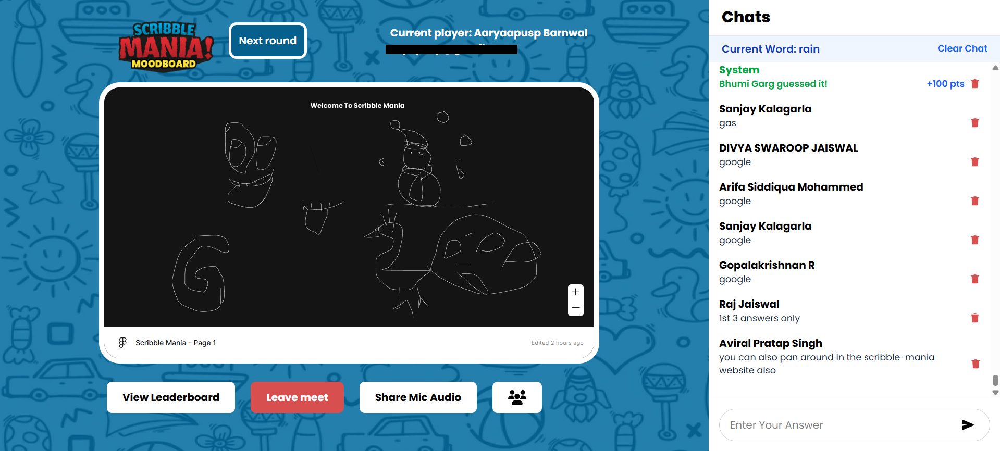

# ✏️ Scribble Mania

**Scribble Mania** is a real-time multiplayer drawing and guessing game built for creativity and fun as an Event by MoodBoard, The Design Club, IIT Patna. Inspired by *Skribbl.io*, it adds a powerful twist: **Figma Canvas integration** for collaborative design-style drawing and **Firebase** for seamless, serverless real-time communication.

## 🚀 Live Demo

🔗 [Play Now](https://scribble-mania.vercel.app)

## 🖼️ Screenshots
 


- 🎨 Drawing canvas powered by Figma Embed
- 💬 Real-time guess chat with scoreboard
- 🧑‍🎨 Admin shares the canvas; others guess live

## 🔥 Key Features

- ✨ **Figma Canvas Embedded**: Enables precision drawing and design collaboration
- ☁️ **Firebase Realtime Database + Auth**: For fast, serverless communication
- 💬 **Live Chat + Word Guessing**: Players guess what’s being drawn in real time
- 🎵 **Live audio sharing with Agora.io**: Admins can share audio and talk to the players
- 🏆 **Dynamic Leaderboard**: Points based on guess speed and correctness

## 🛠️ Tech Stack

| Category | Stack |
|---------|--------|
| Frontend | React + Vite |
| Hosting & Serverless | Vercel |
| Real-time Communication | Firebase Realtime Database |
| Authentication | Firebase Auth |
| Drawing Canvas | Figma Embed API |
| Styling | Tailwind CSS |
| State Management | React Context API |

## 📁 File Structure

```
Scribble-Mania/
├── index.html
├── public/
│   └── logo.png
├── src/
│   ├── assets/              # Images and icons
│   ├── App.jsx
│   ├── Content.jsx
│   ├── Chats.jsx
│   ├── Leaderboard.jsx
│   ├── # Other Components
│   ├── index.css
│   └── firebase.js         # Firebase Configurations
├── .gitignore
├── package.json
├── package-lock.json
├── eslint.config.js
├── tailwind.config.js
├── vite.config.js
└── README.md
```

## ⚙️ Setup Instructions

### 1. Clone the Repository

```bash
git clone https://github.com/raj-jaiswal/Scribble-Mania.git
cd Scribble-Mania
```

### 2. Install Dependencies

```bash
npm install
# or
yarn install
```

### 3. Configure Environment Variables

Rename `env_template.txt` to `.env` and add your Firebase config:

```
VITE_FIREBASE_API=FIREBASE_API
VITE_ADMINS=ADMIN_EMAIL1,ADMIN_EMAIL2
VITE_FIGMA_URL='FIGMA LINK'
VITE_AGORA_APP_ID=APP_ID
VITE_AGORA_CHANNEL=CHANNEL_NAME
```

### 4. Run the Project Locally

```bash
npm run dev
```

Visit `http://localhost:5173` in your browser.

## 🔌 Firebase Services Used

- 🔐 **Authentication** – Join games with a display name
- 🔄 **Realtime Database** – Game state, chat, and drawing sync
- 📦 **Hosting (optional)** – Although deployed via Vercel

## 🧠 How It Works

1. **Admin** starts the game and shares a Figma file or drawing on the embedded canvas.
2. **Players** guess in real-time via chat.
3. **Scores** are updated based on guess correctness and speed.
4. **Figma Embed** allows seamless drawing right inside the app.

## 📦 Deployment

### On Vercel

- Connect this repo to your Vercel dashboard
- Add environment variables under “Project Settings > Environment Variables”
- Deploy directly from your GitHub repo

## 📚 Learn More

- 🔗 [Firebase Docs](https://firebase.google.com/docs)
- 🔗 [Figma Embed Guide](https://www.figma.com/developers/embed)
- 🔗 [Vercel Deployment](https://vercel.com/docs)

## 🤝 Contributing

1. Fork the repo
2. Create your feature branch: `git checkout -b feature/your-feature`
3. Commit changes: `git commit -m "Add feature"`
4. Push and open a pull request

## 📄 License

This project is open source and available under the [MIT License](LICENSE).

---

🎨 Built with ❤️ by [Raj Jaiswal](https://github.com/raj-jaiswal) and [Kunal Deore](https://github.com/kunaldeore-04)

Design meets guessing game – **Scribble Mania** makes drawing competitive and fun!
